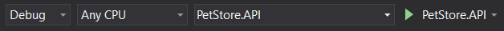

# .NET Coding Challenge

This application was developed for a .NET coding challenge. The main goal is to create an order entry system for a pet store.
## Features

* WebAPI using .NET Core 2.2
* Embedded SQLite database
* Entity Framework Core with migrations
* Test project using MSTest
* OpenAPI/Swagger documentation
* 3-tier application with Core, Data, and Presentation (API) layers

## Running the Application

1. Since the project uses .NET Core 2.2, the latest version of [Visual Studio 2017](https://visualstudio.microsoft.com/downloads/) is required.
1. Download or [clone](https://github.com/idlemachinery/dotnet-code-challenge.git) a copy of the project.
1. Open the `PetStore` solution and ensure that `PetStore.API` is set as the startup project by right-clicking on the project in the Solution Explorer and selecting "Set as StartUp Project".
1. Ensure that you are set to launch the Project and not IIS Express.  In the toolbar area of Visual Studio, make sure you see `PetStore.API` to the right of the green play arrow and not `IIS Express`:
    
1. Press `F5` to start the application with Debugging. A browser window should open to https://localhost:5001

The database will be created and migrated automatically if it doesn't already exist.

### Inserting an order

1. You can insert data directly from the Swagger API documentation screen or by using an application like [Postman](https://www.getpostman.com/).
1. `POST` the following data to https://localhost:5001/api/orders
```json
{
  "customerId": "12345",
  "items": [
    {
      "productId": "8ed0e6f7",
      "quantity": 1
    },
    {
      "productId": "c0258525",
      "quantity": 3
    },
    {
      "productId": "0a207870",
      "quantity": 2
    }
  ]
}
```

You should recieve a status code `201` along with a copy of the order (with total) in the body and a `location` url in the header where you can `GET` the order.

You will recieve a status code of `400 - Bad Request` if the order is null. You will recieve a status code of `404 - Not Found` if any of the product codes are not found.  You will recieve a status code of `422 - Unprocessable Entity` if any validation errors are found.

### Retrieving an order

Once you have inserted at least one order, you can retrieve it from either the Swagger UI, an application like Postman, or simply using the browser.

`GET` the order from https://localhost:5001/api/orders/{id} where `id` is the Order Id.

## Running the Unit Test

1. Open the `PetStore` solution in Visual Studio 2017.
1. From the top menu, select `Test > Windows > Test Explorer` to open the Test Explorer window.
1. From the top menu, select `Test > Run > All Tests` to kick off the test.
1. View the results in the Test Explorer window.